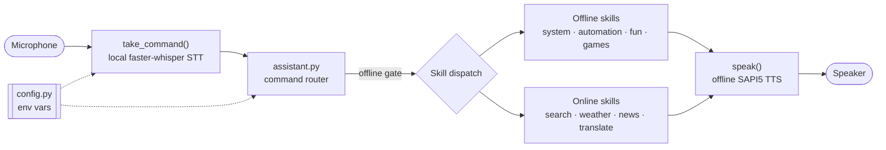

# Olivia

> A modular, offline-capable Python voice assistant for Windows — local Whisper STT, offline SAPI5 TTS, and skills that degrade gracefully without a network.

[](./LICENSE)
[](https://github.com/chirag127/olivia/stargazers)
[](https://github.com/chirag127/olivia/commits/main)
[](https://www.python.org/)
[](https://github.com/chirag127/olivia/actions/workflows/ci.yml)

## What it is / why it exists

Cloud voice assistants ship your microphone audio to someone else's servers and stop working when the network drops. Olivia keeps the core loop **100% on your machine**: it records the mic, transcribes it locally with a Whisper model (`faster-whisper` / CTranslate2), routes the command to a skill, and replies out loud through the offline Windows SAPI5 voice. Optional skills that genuinely need the internet (search, weather, news, translate) run only when online and report an error instead of crashing the loop.

**Live site:** [olivia.oriz.in](https://olivia.oriz.in) · **Landing:** [chirag127.github.io/olivia](https://chirag127.github.io/olivia/) · **Repo:** [github.com/chirag127/olivia](https://github.com/chirag127/olivia)

⭐ If this is useful, please **star the repo** — it helps others find it.

## How it works



Speech recognition (Whisper), text-to-speech (SAPI5), and command routing are fully offline. The Whisper model auto-downloads once from Hugging Face on first run; after that, STT needs no network. Set `OLIVIA_OFFLINE_ONLY=1` and every online skill announces "needs internet" instead of running — the offline half keeps working.

## Features

Voice-controlled, grouped by skill (O = offline, N = needs internet):

- **Search & knowledge** (N) — Google / YouTube / Wikipedia / Bing / DuckDuckGo + 40 other engines; "tell me about X" / "who is X" read Wikipedia summaries aloud.
- **Weather** (N) — current conditions for any city (OpenWeatherMap) + an internet speed test.
- **News** (N) — top BBC headlines (NewsAPI).
- **Translation** (N) — text to 100+ languages via googletrans ("translate hello to french").
- **System monitoring** (O) — CPU / RAM / disk / battery usage (psutil); public IP (N).
- **Media** — play any song/video on YouTube and control it (N); take screenshots (O).
- **Communication** (N) — send email (env-var credentials) and WhatsApp messages.
- **Automation** (O) — launch / close apps, press keys, type dictation, lock the screen, power control (shutdown/restart/logout/hibernate).
- **Fun** — offline jokes / cards / dice / random-password generation (O); online dad jokes (N).
- **Games** (O) — a Tkinter Tic-Tac-Toe with pure, testable win logic.

## Tech stack

- **Python 3.10+** — packaged under `src/olivia/`, installable (`pip install -e .`), console entry point `olivia`.
- **faster-whisper** (CTranslate2) — local speech-to-text, no cloud STT.
- **pyttsx3** — offline Windows SAPI5 text-to-speech.
- **sounddevice / numpy** — mic capture.
- **psutil / pyautogui / pyperclip / winshell / pywin32** — system + desktop automation (Windows).
- **wikipedia / pyowm / requests / googletrans / pywhatkit / speedtest-cli / pyjokes** — the online skills.

## Repo structure

```
src/olivia/
  __main__.py          # entry point: python -m olivia
  core/
    speech.py          # speak() SAPI5 TTS + take_command() local Whisper STT
    assistant.py       # main loop + command router + offline/online gating
    config.py          # env-var config (model, offline_only, email, API keys, voice)
  skills/              # search · weather · news · translate · system · media ·
                       #   communication · automation · fun  (one module per group)
  games/tic_tac_toe.py # Tkinter game, pure win/tie logic
  utils/helpers.py     # time/date/greeting, clipboard, tab helpers
tests/                 # pure-logic tests (mocked mic/model, no network)
docs/                  # olivia.oriz.in landing page (CNAME)
```

The router in `core/assistant.py` maps spoken phrases to skill functions via small dispatch tables; every skill is independently importable and testable, with heavy/native imports kept lazy so modules load on headless CI.

## Quick start

```bash
git clone https://github.com/chirag127/olivia.git
cd olivia
pip install -r requirements.txt   # or: pip install -e .
cp .env.example .env              # then fill in the values (all optional)
python -m olivia
```

**First run downloads the Whisper model** (`base` ≈ 145 MB) from Hugging Face into the local cache — this needs internet once. After that, STT runs fully offline. Say `bye` / `goodbye` / `exit` to quit.

Run with no network at all (after the model is cached):

```bash
OLIVIA_OFFLINE_ONLY=1 python -m olivia
```

## Configuration

Copy `.env.example` to `.env`. All variables are optional; no credentials are hardcoded in source.

| Variable | Purpose |
| --- | --- |
| `OLIVIA_WHISPER_MODEL` | Local STT model size: `tiny`/`base`/`small`/`medium`/`large-v3` (default `base`) |
| `OLIVIA_WHISPER_DEVICE` | `cpu` (offline default) or `cuda` |
| `OLIVIA_WHISPER_COMPUTE_TYPE` | CTranslate2 compute type (default `int8`) |
| `OLIVIA_WHISPER_LANGUAGE` | Spoken-language hint, e.g. `en`; empty = auto-detect |
| `OLIVIA_OFFLINE_ONLY` | `1` disables all online skills (default `0`) |
| `OLIVIA_EMAIL` | Gmail address for the email / WhatsApp skills |
| `OLIVIA_EMAIL_PASSWORD` | Gmail app password (never a real login password) |
| `OPENWEATHER_API_KEY` | OpenWeatherMap key for the weather skill |
| `NEWS_API_KEY` | NewsAPI key for BBC headlines |
| `OLIVIA_VOICE_INDEX` | SAPI5 voice index (0 = male, 1 = female) |

## Command reference

| Say | Olivia does |
| --- | --- |
| "search cats on youtube" | Opens a YouTube search |
| "tell me about python" | Reads a Wikipedia summary |
| "current weather in london" | Speaks current weather |
| "latest news" | Reads BBC headlines |
| "translate hello to french" | Speaks the translation |
| "what is the cpu usage" | Speaks CPU load |
| "play lofi beats" | Plays on YouTube; then "pause", "volume up", "next" |
| "take a screenshot" | Saves a timestamped PNG |
| "launch notepad" / "close chrome" | Starts / kills an app |
| "lock screen" | Locks Windows |
| "generate password" | Speaks a random password |
| "start tic tac toe game" | Opens the game window |
| "bye" | Exits |

## Requirements

- Windows (SAPI5 TTS, `winshell`, `pywin32`, `pyautogui`)
- Python 3.10+ and a working microphone
- ~150 MB disk + one-time internet for the Whisper model download (`base`)

## Testing

```bash
pip install pytest pytest-cov numpy
pytest -q
```

Tests cover the pure logic — Tic-Tac-Toe win/tie detection, command routing (mocked speech I/O), offline-only gating, local-Whisper STT (mocked mic + model, no network), translation language detection, search routing, config env reading, and password/greeting helpers.

## Part of the oriz family

Olivia is one of ~80 sites and tools in the **oriz** family. See the others at [blog.oriz.in](https://blog.oriz.in).

## Contributing

Issues and PRs welcome. Keep skills self-contained: one module per feature group, heavy/native imports lazy inside functions so the module stays importable on headless CI. Run `pytest` before opening a PR.

## Status

Stable (`v1.0.0`). The former 8500-line monolith has been refactored into a clean, tested package. Roadmap: more offline skills, richer wake-word handling, and cross-platform TTS.

## License

[MIT](./LICENSE) © 2026 Chirag Singhal · [chirag@oriz.in](mailto:chirag@oriz.in)

_Conventional commits are the changelog._
